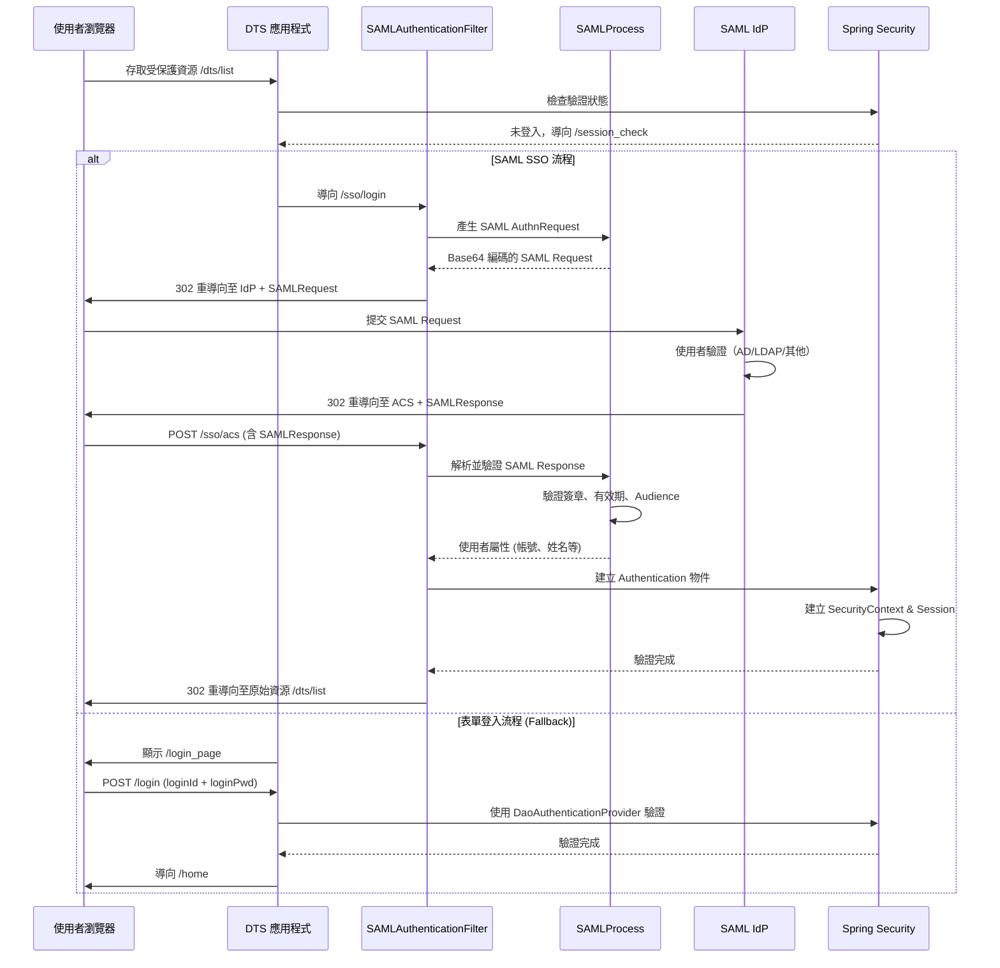
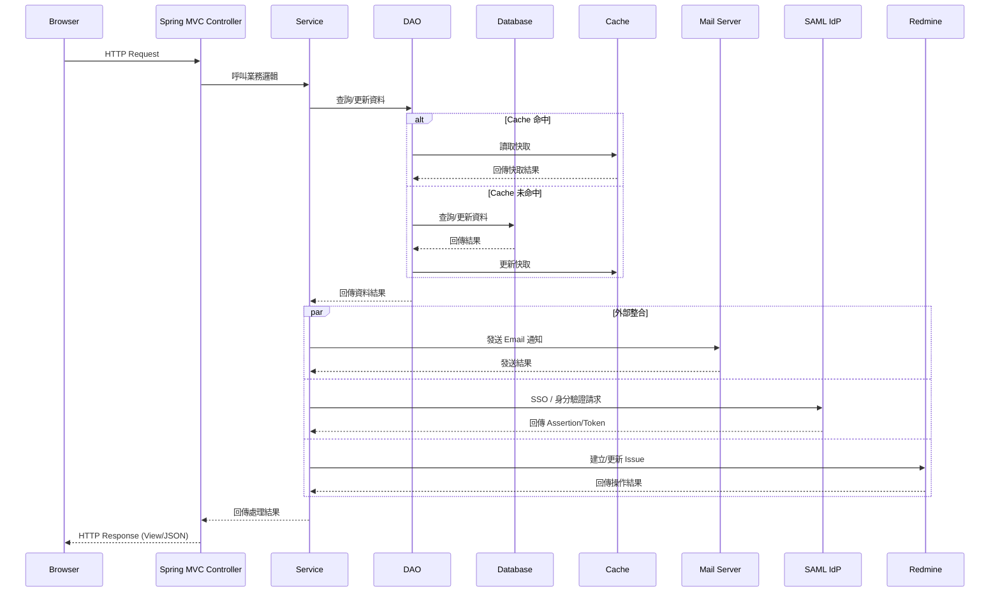

# DTS 核心技術與架構

## 目錄

- [核心技術與架構](#核心技術與架構)
  - [概述](#概述)
  - [Web 層](#web-層)
    - [Filter 與初始化參數說明](#filter-與初始化參數說明)
  - [業務與資料層](#業務與資料層)
    - [DI 與 AOP 範例](#di-與-aop-範例)
      - [1. 自訂 `@Log` 註解](#1-自訂-log-註解)
      - [2. 服務層呼叫記錄：`LoggingAspect`](#2-服務層呼叫記錄loggingaspect)
      - [3. DAO 呼叫監控與 JMX 暴露：`CallMonitoringAspect`](#3-dao-呼叫監控與-jmx-暴露callmonitoringaspect)
    - [Hibernate + HikariCP 設定範例（實際程式）](#hibernate--hikaricp-設定範例實際程式)
    - [快取（Ehcache / ConcurrentMap + Spring Cache）範例（實際程式）](#快取ehcache--concurrentmap--spring-cache範例實際程式)
      - [1. Ehcache 組態：`CacheConfig`](#1-ehcache-組態cacheconfig)
      - [2. 開發用 ConcurrentMap 快取：`ConcurrentMapCacheConfig`](#2-開發用-concurrentmap-快取concurrentmapcacheconfig)
      - [3. 使用快取的 DAO / Service 範例（以 `AccountDaoImpl` 為例）](#3-使用快取的-dao--service-範例以-accountdaoimpl-為例)
  - [安全](#安全)
    - [Spring Security 設定（實際程式）](#spring-security-設定實際程式)
    - [自訂加解密工具（實際程式）](#自訂加解密工具實際程式)
    - [SAML SSO 整合（實際架構）](#saml-sso-整合實際架構)
      - [1. OpenSAML 初始化](#1-opensaml-初始化)
      - [2. SAML 處理元件（Web 層）](#2-saml-處理元件web-層)
      - [3. SAML 安全過濾器（Security 層）](#3-saml-安全過濾器security-層)
      - [4. SSO 完整流程](#4-sso-完整流程)
      - [5. 設定檔與憑證](#5-設定檔與憑證)
  - [其他整合](#其他整合)
    - [郵件整合（實際程式）](#郵件整合實際程式)
    - [Bean Validation 與 Logging](#bean-validation-與-logging)
  - [專案結構與請求流程](#專案結構與請求流程)

---

## 概述

這是一個基於 **Servlet 4.0** 的 **傳統 Spring Framework（非 Spring Boot）Java Web 應用**，
使用 `Java Config` + `WebApplicationInitializer` 啟動，不依賴 `web.xml` 的 Spring Context Loader，
方便在 IDE 中以嵌入式容器或外部 Tomcat 9+ 部署。

下列將依「Web 層、業務與資料層、安全、其他整合」四個面向，說明核心技術並附上實際範例。

---

## Web 層

**技術點**

- Servlet 4.0 容器（Tomcat 9 等）
- Spring MVC（`WebAppConfig`, `WebAppInitializer`）
- Apache Tiles + JSP 作頁面佈局
- 前端：jQuery / Bootstrap / DataTables / jqGrid 等插件

**啟動與 DispatcherServlet 設定（實際程式）**

專案使用 `com.acer.dts.util.config.WebAppInitializer` 作為入口，繼承 `AbstractAnnotationConfigDispatcherServletInitializer`，
在 `onStartup` 中啟動 Spring Context，並透過 Java Config 載入各種設定：

```java
@Order(1)
public class WebAppInitializer extends AbstractAnnotationConfigDispatcherServletInitializer {

    private static final Logger LOGGER = LoggerFactory.getLogger(WebAppInitializer.class);

    @Override
    protected String[] getServletMappings() {
        // 所有請求都進入 DispatcherServlet，由 Spring MVC 控制
        return new String[]{"/"};
    }

    @Override
    public void onStartup(ServletContext servletContext) throws ServletException {
        LOGGER.info("[Enter] WebAppInitializer.onStartup");
        super.onStartup(servletContext);
    }

    @Override
    protected Class<?>[] getRootConfigClasses() {
        // 核心組態：應用程式、Hibernate、快取、Mail、FreeMarker、Redmine、Security 等
        return new Class<?>[] {
            AppConfig.class,
            HibernateConfig.class,
            CacheConfig.class,
            MailConfig.class,
            FreemarkerConfig.class,
            RedmineDataSourceConfig.class,
            SecurityConfig.class
        };
    }

    @Override
    protected Class<?>[] getServletConfigClasses() {
        // MVC / View 相關設定
        return new Class<?>[]{WebAppConfig.class};
    }
```

### Filter 與初始化參數說明

`WebAppInitializer` 會註冊多個 Filter，並設定 DispatcherServlet 的初始化參數：

```java
    @Override
    protected Filter[] getServletFilters() {
        // Open Session In View：避免 Lazy Initialization Exception
        OpenSessionInViewFilter openSessionInViewFilter = new OpenSessionInViewFilter();

        // 強制使用 UTF-8 編碼
        CharacterEncodingFilter characterEncodingFilter = new CharacterEncodingFilter();
        characterEncodingFilter.setEncoding("UTF-8");
        characterEncodingFilter.setForceEncoding(true);

        // Spring Security 過濾鏈，對應 bean name "springSecurityFilterChain"
        DelegatingFilterProxy securityFilterChain = new DelegatingFilterProxy("springSecurityFilterChain");

        return new Filter[]{openSessionInViewFilter, characterEncodingFilter, securityFilterChain};
    }

    @Override
    protected void customizeRegistration(ServletRegistration.Dynamic registration) {
        registration.setInitParameter("defaultHtmlEscape", "true");
        registration.setInitParameter("spring.profiles.active", "prod");
        registration.setInitParameter("webAppRootKey", "acer.dts.root");
        registration.setInitParameter("productionMode", "false");
        registration.setInitParameter("closeIdleSessions", "true");
        registration.setInitParameter("pushmode", "automatic");
        registration.setAsyncSupported(true);
    }
}
```

> 總結：`WebAppInitializer` 取代了傳統 `web.xml` 中的 DispatcherServlet 與 Filter 設定，
> 並集中載入應用程式核心組態以及安全、快取、郵件、FreeMarker、Redmine 等整合設定，
> 方便在 IDE（嵌入式容器）或外部 Tomcat 9+ 中以 Java Config 方式啟動專案。

```java
// 實際：WebAppConfig（MVC, 靜態資源, Thymeleaf, Tiles, i18n, SAML 等）
@Configuration
@ComponentScan(
    basePackageClasses = { Application.class },
    includeFilters = @ComponentScan.Filter(Controller.class),
    useDefaultFilters = false
)
class WebAppConfig extends WebMvcConfigurationSupport {

    @Override
    protected void addInterceptors(InterceptorRegistry registry) {
        // i18n 語系切換攔截器：?lang=zh_TW / en
        LocaleChangeInterceptor localeChangeInterceptor = new LocaleChangeInterceptor();
        localeChangeInterceptor.setParamName("lang");
        registry.addInterceptor(localeChangeInterceptor);
    }

    @Override
    public void addResourceHandlers(ResourceHandlerRegistry registry) {
        // /resources/** 與 /webjars/** 的靜態資源處理，並設定長時間快取
        registry.addResourceHandler("/webjars/**")
                .addResourceLocations("/webjars/")
                .setCachePeriod(31556926);
        registry.addResourceHandler("/resources/**")
                .addResourceLocations("/resources/")
                .setCachePeriod(31556926);
    }

    @Bean
    public LocaleResolver localeResolver() {
        // 使用 Cookie 記錄使用者語系偏好，預設為 en
        CookieLocaleResolver resolver = new CookieLocaleResolver();
        resolver.setDefaultLocale(StringUtils.parseLocaleString("en"));
        return resolver;
    }

    @Bean(name = "messageSource")
    public MessageSource messageSource() {
        // 對應 /WEB-INF/i18n/messages.properties 族群，支援熱更新
        ReloadableResourceBundleMessageSource messageSource = new ReloadableResourceBundleMessageSource();
        messageSource.setBasename("/WEB-INF/i18n/messages");
        messageSource.setCacheSeconds(5);
        messageSource.setDefaultEncoding("UTF-8");
        messageSource.setUseCodeAsDefaultMessage(true);
        return messageSource;
    }

    // Thymeleaf 模板引擎 + Tiles 版型
    @Bean
    public ServletContextTemplateResolver templateResolver() {
        ServletContextTemplateResolver resolver = new ServletContextTemplateResolver();
        resolver.setPrefix("/WEB-INF/views/");
        resolver.setSuffix(".html");
        resolver.setTemplateMode("HTML5");
        resolver.setCacheable(false);
        return resolver;
    }

    @Bean
    public SpringTemplateEngine templateEngine() {
        SpringTemplateEngine engine = new SpringTemplateEngine();
        engine.addTemplateResolver(templateResolver());
        engine.addDialect(new SpringSecurityDialect());
        engine.addDialect(new TilesDialect());
        engine.addDialect(new LayoutDialect());
        return engine;
    }

    @Bean
    public ViewResolver thymeleafViewResolver() {
        ThymeleafViewResolver viewResolver = new ThymeleafViewResolver();
        viewResolver.setTemplateEngine(templateEngine());
        viewResolver.setCharacterEncoding("UTF-8");
        viewResolver.setOrder(Ordered.HIGHEST_PRECEDENCE);
        viewResolver.setExcludedViewNames(new String[]{"message/*"});
        return viewResolver;
    }

    @Bean
    public ViewResolver tilesViewResolver() {
        ThymeleafViewResolver viewResolver = new ThymeleafViewResolver();
        viewResolver.setTemplateEngine(templateEngine());
        viewResolver.setViewClass(ThymeleafTilesView.class);
        viewResolver.setCharacterEncoding("UTF-8");
        viewResolver.setOrder(Ordered.LOWEST_PRECEDENCE);
        return viewResolver;
    }

    @Bean
    public ThymeleafTilesConfigurer tilesConfigurer() {
        ThymeleafTilesConfigurer ttc = new ThymeleafTilesConfigurer();
        ttc.setDefinitions("/WEB-INF/config/tiles-definitions.xml");
        return ttc;
    }

    @Bean
    public CommonsMultipartResolver multipartResolver() {
        CommonsMultipartResolver r = new CommonsMultipartResolver();
        r.setMaxUploadSize(10 * 1024 * 1024); // 10MB
        r.setDefaultEncoding("utf-8");
        return r;
    }

    @Bean
    public SAMLProcess samlProcess() {
        // 提供 SAML SSO 處理元件給 Spring MVC 使用
        return new SAMLProcess();
    }
}
```

> 補充：`WebAppConfig` 不僅負責 MVC 基本設定，還整合了 i18n、驗證器、靜態資源、Thymeleaf + Tiles 佈局、
> 檔案上傳 (`CommonsMultipartResolver`) 與 SAML SSO (`SAMLProcess` bean)，
> 搭配 `WebAppInitializer` 共同構成完整的 Web 層啟動與視圖配置。

**Controller 與 View（Thymeleaf）範例**

`WebAppConfig` 中內建了首頁與 favicon 的 Controller，並將 View 交給 Thymeleaf/Tiles 處理：

```java
@Controller
static class IndexController {

    @RequestMapping(value = {"/", "/index"}, method = RequestMethod.GET)
    String index() {
        // 對應 /WEB-INF/views/index.html（由 ThymeleafViewResolver 處理）
        return "index";
    }
}

@Controller
static class FaviconController {

    @RequestMapping("favicon.ico")
    String favicon() {
        // 轉發到靜態資源 /resources/images/favicon.ico
        return "forward:/resources/images/favicon.ico";
    }
}
```

實際的業務 Controller 會回傳邏輯 View Name（例如 `dts/list` 或 Tiles 定義名稱），
由 `thymeleafViewResolver` 與 `tilesViewResolver` 共同決定對應到 `/WEB-INF/views/*.html` 或 Tiles 版型。

前端頁面主要使用 Thymeleaf 模板搭配 jQuery、Bootstrap、DataTables、jqGrid 等插件進行表格呈現與分頁查詢，
相關靜態資源位於 `src/main/webapp/resources` 下，並透過 `addResourceHandlers` 以 `/resources/**` 對外提供。

---

## 業務與資料層

**技術點**

- Spring DI + AOP（自訂 `@Log` 註解，`LoggingAspect`, `CallMonitoringAspect`）
- Hibernate ORM（`HibernateConfig`, `domain/*` 實體）
- HikariCP 連線池（`hikari.properties`）
- Spring Transaction 管理
- Ehcache / Spring Cache（二級快取 / 應用快取）

### DI 與 AOP 範例

#### 1. 自訂 `@Log` 註解

實作在 `com.acer.dts.util.annotation.Log`，目前標註在 **欄位層級**，主要用於自動注入 Logger 或日後擴充：

```java
@Retention(RetentionPolicy.RUNTIME)
@Target(ElementType.FIELD)
@Inherited
@Documented
public @interface Log {
}
```

#### 2. 服務層呼叫記錄：`LoggingAspect`

`LoggingAspect` 會攔截 `com.acer.dts.function.*.service..*.*(..)` 下所有 Service 方法，
使用 SLF4J 搭配 `StopWatch` 記錄執行時間與參數：

```java
@Component
@Aspect
public class LoggingAspect {

    private static final Logger LOGGER = LoggerFactory.getLogger(LoggingAspect.class);

    @Around("execution(* com.acer.dts.function.*.service..*.*(..))")
    public Object log(ProceedingJoinPoint joinPoint) throws Throwable {
        StopWatch stopWatch = new StopWatch();
        stopWatch.start();
        LOGGER.info("Calling " + joinPoint.getSignature().getName() + " method...");

        Object retVal = joinPoint.proceed();

        stopWatch.stop();
        StringBuilder buffer = new StringBuilder();
        buffer.append(joinPoint.getTarget().getClass().getName()).append(".");
        buffer.append(joinPoint.getSignature().getName()).append("(");
        buffer.append(Joiner.on(", ").join(joinPoint.getArgs()));
        buffer.append(") execution time : ").append(stopWatch.getTime()).append("ms");
        LOGGER.info(buffer.toString());
        return retVal;
    }
}
```

#### 3. DAO 呼叫監控與 JMX 暴露：`CallMonitoringAspect`

`CallMonitoringAspect` 會針對所有 `@Repository` 類別的方法做統計，並透過 Spring JMX 暴露監控資訊：

```java
@ManagedResource("internalproject:type=CallMonitor")
@Aspect
public class CallMonitoringAspect {

    private boolean enabled = true;
    private int callCount = 0;
    private long accumulatedCallTime = 0;

    @ManagedAttribute
    public void setEnabled(boolean enabled) {
        this.enabled = enabled;
    }

    @ManagedAttribute
    public boolean isEnabled() {
        return enabled;
    }

    @ManagedOperation
    public void reset() {
        this.callCount = 0;
        this.accumulatedCallTime = 0;
    }

    @ManagedAttribute
    public int getCallCount() {
        return callCount;
    }

    @ManagedAttribute
    public long getCallTime() {
        if (this.callCount > 0)
            return this.accumulatedCallTime / this.callCount;
        else
            return 0;
    }

    @Around("within(@org.springframework.stereotype.Repository *)")
    public Object invoke(ProceedingJoinPoint joinPoint) throws Throwable {
        if (this.enabled) {
            StopWatch sw = new StopWatch(joinPoint.toShortString());
            sw.start("invoke");
            try {
                return joinPoint.proceed();
            } finally {
                sw.stop();
                synchronized (this) {
                    this.callCount++;
                    this.accumulatedCallTime += sw.getTotalTimeMillis();
                }
            }
        } else {
            return joinPoint.proceed();
        }
    }
}
```

> 總結：透過 `LoggingAspect` 可以在 Service 層統一記錄方法參數與執行時間，
> 而 `CallMonitoringAspect` 則針對 DAO 層提供 JMX 監控（呼叫次數與平均耗時），
> 再搭配 `@Log` 註解為未來更精細的日誌注入或標記擴充預留彈性。

### Hibernate + HikariCP 設定範例（實際程式）

實際的 Hibernate 設定集中在 `com.acer.dts.util.config.HibernateConfig`，
利用 `OracleDataSource` + HikariCP 建立連線池，並組裝 Hibernate `SessionFactory` 與交易管理：

```java
@Configuration
@EnableTransactionManagement
public class HibernateConfig {

    @Value("${db.driverClassName}")
    private String driver;
    @Value("${db.url}")
    private String url;
    @Value("${db.username}")
    private String username;
    @Value("${db.password}")
    private String password;

    @Value("${hikari.autoCommit}")
    private boolean autoCommit;
    @Value("${hikari.connectionTimeout}")
    private long connectionTimeout;
    @Value("${hikari.idleTimeout}")
    private long idleTimeout;
    @Value("${hikari.maxLifetime}")
    private long maxLifetime;
    @Value("${hikari.maximumPoolSize}")
    private int maxPoolSize;
    @Value("${hikari.transactionIsolation}")
    private String transactionIsolation;

    @Value("${entitymanager.packages.to.scan}")
    private String entitymanagerPackagesScan;

    // 1. Oracle DataSource（負責真實連線）
    @Bean
    @Description("This is for Oracle data source usage")
    public OracleDataSource oracleDataSource() {
        Objects.requireNonNull(url);
        Objects.requireNonNull(username);
        Objects.requireNonNull(password);
        OracleDataSource ds;
        try {
            ds = new OracleDataSource();
            ds.setURL(url);
            ds.setUser(username);
            ds.setPassword(password);
            ds.setExplicitCachingEnabled(true);
        } catch (SQLException e) {
            ds = null;
            LOGGER.error(e.getMessage(), e);
        }
        Objects.requireNonNull(ds);
        return ds;
    }

    // 2. HikariCP 連線池，包裝 OracleDataSource
    @Bean(destroyMethod = "close")
    public HikariDataSource hikariDataSource() {
        HikariDataSource ds = new HikariDataSource();
        ds.setDataSource(oracleDataSource());
        ds.setAutoCommit(autoCommit);
        ds.setConnectionTimeout(connectionTimeout);
        ds.setIdleTimeout(idleTimeout);
        ds.setMaxLifetime(maxLifetime);
        ds.setMaximumPoolSize(maxPoolSize);
        ds.setTransactionIsolation(transactionIsolation);
        return ds;
    }

    // 3. Hibernate SessionFactory
    @Bean
    public LocalSessionFactoryBean sessionFactory() {
        LocalSessionFactoryBean factoryBean = new LocalSessionFactoryBean();
        factoryBean.setDataSource(hikariDataSource());
        factoryBean.setPackagesToScan(entitymanagerPackagesScan);
        factoryBean.setNamingStrategy(new UpperCaseNamingStrategy());
        factoryBean.setHibernateProperties(hibernateProperties());
        return factoryBean;
    }

    // 4. Hibernate Properties（預留配置點，必要時可透過程式設定 dialect/show_sql 等參數）
    Properties hibernateProperties() {
        return new Properties() {
            {
                // setProperty(Environment.SHOW_SQL, "true");
                // setProperty(Environment.FORMAT_SQL, "true");
                // setProperty(Environment.USE_QUERY_CACHE, "true");
                // setProperty("hibernate.hbm2ddl.auto", "");
                // setProperty("hibernate.dialect", "");
            }
        };
    }

    // 5. 交易管理與例外轉換
    @Bean
    @Autowired
    public HibernateTransactionManager transactionManager(SessionFactory sessionFactory) {
        HibernateTransactionManager txManager = new HibernateTransactionManager();
        txManager.setSessionFactory(sessionFactory);
        return txManager;
    }

    @Bean
    public PersistenceExceptionTranslationPostProcessor persistenceExceptionTranslationPostProcessor() {
        return new PersistenceExceptionTranslationPostProcessor();
    }
}
```

> 說明：資料庫連線相關設定（`db.*`, `hikari.*`, `entitymanager.packages.to.scan`）
> 透過 Spring `@Value` 自外部設定檔注入，`HibernateConfig` 則負責：
> 1. 建立 Oracle DataSource 並開啟快取
> 2. 以 HikariCP 包裝成高效能連線池
> 3. 組裝 Hibernate SessionFactory（含自訂 UpperCaseNamingStrategy）
> 4. 建立 HibernateTransactionManager 與 PersistenceExceptionTranslationPostProcessor，
>    讓 DAO 層能使用宣告式交易並自動將底層例外轉換為 Spring 的資料存取例外階層。

### 快取（Ehcache / ConcurrentMap + Spring Cache）範例（實際程式）

專案提供兩套 Cache 設定：

- `CacheConfig`：預設使用 Ehcache，適合正式環境或需要較完整快取功能時。
- `ConcurrentMapCacheConfig`：在 `dev` Profile 下使用 `ConcurrentMapCacheManager`，方便開發除錯。

#### 1. Ehcache 組態：`CacheConfig`

```java
@Configuration
@EnableCaching
//@Profile("prod")
public class CacheConfig {

    private static final Logger LOGGER = LoggerFactory.getLogger(CacheConfig.class);

    @Bean
    public CacheManager cacheManager() {
        LOGGER.info("Cache manager is ehCacheCacheManager");
        return new EhCacheCacheManager(ehCacheCacheManager().getObject());
    }

    @Bean
    public EhCacheManagerFactoryBean ehCacheCacheManager() {
        EhCacheManagerFactoryBean cache = new EhCacheManagerFactoryBean();
        cache.setConfigLocation(new ClassPathResource("cache/ehcache.xml"));
        cache.setShared(true);
        return cache;
    }

    @Bean
    public KeyGenerator enhancedDefaultKeyGenerator() {
        return new EnhancedDefaultKeyGenerator();
    }
}
```

`cache/ehcache.xml` 中定義各個 cache 區域與 TTL/容量等設定，
`EnhancedDefaultKeyGenerator` 則用於產生更穩定、可讀性較高的快取 key（避免參數順序或 toString 差異造成快取 miss）。

#### 2. 開發用 ConcurrentMap 快取：`ConcurrentMapCacheConfig`

```java
@Configuration
@EnableCaching
@Profile("dev")
public class ConcurrentMapCacheConfig {

    private static final Logger LOGGER = LoggerFactory.getLogger(ConcurrentMapCacheConfig.class);

    @Bean
    public CacheManager concurrentMapCache() {
        LOGGER.info("Cache manager is concurrentMapCacheManager");
        return new ConcurrentMapCacheManager("test-cache");
    }
}
```

當啟用 `dev` Profile 時，會改用記憶體中的 `ConcurrentMapCacheManager`，避免額外安裝/配置 Ehcache，
適合在本機開發或單元測試時快速啟動、觀察快取行為。

#### 3. 使用快取的 DAO / Service 範例（以 `AccountDaoImpl` 為例）

`com.acer.dts.function.account.dao.impl.AccountDaoImpl` 中實際使用了 Spring Cache：

```java
@Repository
public class AccountDaoImpl extends AbstractDao implements AccountDao {

    @Override
    @Cacheable("account-cache")
    public Stream<Account> findAll() {
        // 只要方法參數相同，就會先從 "account-cache" 取結果；
        // 第一次查詢才真的打到資料庫，之後命中快取就不會再查 DB。
        return getSession().createCriteria(Account.class).list().stream();
    }

    // @Cacheable(value = "account-cache", key = "#pid")
    public Optional<Account> findById(String pid) {
        return Optional.ofNullable((Account) getSession().load(Account.class, pid));
    }
}
```

> 說明：
> - 透過 `@EnableCaching` + `CacheManager`（例如 `CacheConfig` 中設定的 Ehcache）啟用全域快取機制。
> - 在 `AccountDaoImpl.findAll()` 上標註 `@Cacheable("account-cache")` 後，Spring 會以方法簽章與參數組合成快取 key，將查詢結果緩存到 `account-cache` 區域。
> - 後續相同條件呼叫 `findAll()` 時，若快取未過期，會直接從快取回傳 `Stream<Account>` 對應的集合內容，而不再打 DB，降低資料庫負載。
> - 若需要針對單筆查詢快取，可啟用 `findById` 上的 `@Cacheable(value = "account-cache", key = "#pid")`（目前程式碼中以註解方式保留示範），透過主鍵 `pid` 作為 key 精準快取單一帳號物件。

---

## 安全

**技術點**

- Spring Security（`SecurityConfig`, `WebAppSecurityInitializer`, `function/security/*`）
- 自訂加解密工具（`CryptoUtil`, `EncryptionConverter`, `key.properties`）
- OpenSAML SSO 整合（`META-INF/services/org.opensaml.core.config.Initializer`）

### Spring Security 設定（實際程式）

專案中的 `com.acer.dts.util.config.SecurityConfig` 透過系統參數動態切換多種認證策略，
並整合 SAML SSO Filter，提供彈性的安全機制：

```java
@EnableWebSecurity
public class SecurityConfig extends WebSecurityConfigurerAdapter {

    // 系統參數常數：控制認證行為
    public static final String AD_CONNECT_ENABLED = "AD_CONNECT_ENABLED";
    public static final String CHECK_PWD_ENABLED = "CHECK_PWD_ENABLED";
    public static final String SYNC_DATA_ENABLED = "SYNC_DATA_ENABLED";
    public static final String PWD_ENCODER_ENABLED = "PWD_ENCODER_ENABLED";

    @Autowired
    @Qualifier("dtsUserDetailsService")
    private UserDetailsService userDetailsService;

    @Autowired
    private SystemService systemService;

    @Autowired
    private AutoLoginAuthenticationProvider autoLoginAuthenticationProvider;

    @Autowired
    private DtsAuthenticationProvider dtsAuthenticationProvider;

    @Bean
    public AuthenticationProvider authenticationProvider() {
        String pwdEncoderEnabledStr = systemService.findParmValue(PWD_ENCODER_ENABLED);
        
        if ("1".equals(pwdEncoderEnabledStr)) {
            // 使用自訂 DtsAuthenticationProvider（支援密碼編碼）
            return dtsAuthenticationProvider;
        } else {
            // 使用標準 DaoAuthenticationProvider 搭配 UserDetailsService
            DaoAuthenticationProvider authenticationProvider = new DaoAuthenticationProvider();
            authenticationProvider.setUserDetailsService(userDetailsService);
            return authenticationProvider;
        }
    }

    @Bean
    @SuppressWarnings("deprecation")
    public PasswordEncoder passwordEncoder() {
        // 目前使用 MD5（已過時），建議升級為 BCryptPasswordEncoder
        return new Md5PasswordEncoder();
    }

    @Override
    protected void configure(HttpSecurity http) throws Exception {
        http
            // 在標準登入 Filter 前掛入 SAML SSO Filter
            .addFilterBefore(new SAMLAuthenticationFilter(), UsernamePasswordAuthenticationFilter.class)
            .authorizeRequests()
                // 放行 SSO 相關、靜態資源、REST API 及登入頁
                .antMatchers("/sso/**", "/resources/**", "/rest/**", "/session_check", "/login_page", "/login").permitAll()
                // 其他請求需驗證
                .anyRequest().authenticated()
            .and()
                .formLogin()
                    .usernameParameter("loginId")
                    .passwordParameter("loginPwd")
                    .loginPage("/session_check")
                    .loginProcessingUrl("/login")
                    .defaultSuccessUrl("/home", true)
                    .failureUrl("/login_page?error=1")
            .and()
                // 停用 CSRF，允許同源 frame（例如內嵌報表）
                .csrf().disable()
                .headers().frameOptions().sameOrigin();
    }

    @Override
    protected void configure(AuthenticationManagerBuilder auth) throws Exception {
        String adConnectEnabledStr = systemService.findParmValue(AD_CONNECT_ENABLED);
        String checkPwdEnabledStr = systemService.findParmValue(CHECK_PWD_ENABLED);
        String syncDataEnabledStr = systemService.findParmValue(SYNC_DATA_ENABLED);

        if ("1".equals(adConnectEnabledStr)) {
            // 啟用 AD/LDAP 驗證
            if ("1".equals(syncDataEnabledStr)) {
                // 同步 AD 資料至 DTS 系統
            }
        } else {
            if ("1".equals(checkPwdEnabledStr)) {
                // 使用 DTS DB 驗證帳號密碼
                auth.authenticationProvider(authenticationProvider());
            } else {
                // 只檢查帳號，不驗證密碼（搭配外部 SSO）
                auth.authenticationProvider(autoLoginAuthenticationProvider);
            }
        }
    }
}
```

**安全初始化：`WebAppSecurityInitializer`**

`WebAppSecurityInitializer` 標註 `@Order(10)` 以確保在 `WebAppInitializer`（`@Order(1)`）之後載入，
繼承 `AbstractSecurityWebApplicationInitializer` 後會自動註冊 Spring Security Filter Chain：

```java
@Order(10)
public class WebAppSecurityInitializer extends AbstractSecurityWebApplicationInitializer {
    // 空實作即可，父類別會自動註冊 springSecurityFilterChain
}
```

> 總結：
> - **彈性認證策略**：透過 `SystemService` 動態讀取系統參數（`AD_CONNECT_ENABLED`, `CHECK_PWD_ENABLED`, `SYNC_DATA_ENABLED`, `PWD_ENCODER_ENABLED`），
>   在執行期決定使用 AD/LDAP、DTS DB 驗證或自動登入模式，無需重新編譯即可切換環境。
> - **多重 AuthenticationProvider**：
>   - `DtsAuthenticationProvider`：自訂驗證邏輯，支援密碼編碼
>   - `DaoAuthenticationProvider`：標準 Spring Security 驗證，搭配 `UserDetailsService`
>   - `AutoLoginAuthenticationProvider`：僅檢查帳號存在性，不驗證密碼（適合與外部 SSO 整合）
> - **SAML SSO 整合**：`SAMLAuthenticationFilter` 在 `UsernamePasswordAuthenticationFilter` 前攔截 SAML 請求，
>   搭配 Web 層的 `SAMLProcess` bean 與 OpenSAML 初始化器完成 SSO 流程。
> - **URL 授權規則**：
>   - `/sso/**`, `/resources/**`, `/rest/**`, `/session_check`, `/login_page`, `/login` → 公開存取
>   - 其他路徑 → 需登入驗證
> - **Java Config 啟動**：`WebAppSecurityInitializer` 取代傳統 `web.xml` 的 `DelegatingFilterProxy` 設定，
>   與 `WebAppInitializer` 協同完成無 `web.xml` 的 Spring Security 啟動流程。

### 自訂加解密工具（實際程式）

專案中的 `com.acer.dts.function.security.CryptoUtil` 提供基於 AES 的加解密功能，
透過 Spring `@Component` 注入，並從設定檔讀取加密演算法與金鑰：

```java
@Component
public class CryptoUtil {

    @Value("${encrypt.algorithm}")
    private String algorithm;
    
    @Value("${encrypt.key}")
    private String key;

    public String encrypt(String data) throws Exception {
        Cipher cipher = Cipher.getInstance(algorithm);
        SecretKey secretKey = new SecretKeySpec(key.getBytes(), algorithm);
        cipher.init(Cipher.ENCRYPT_MODE, secretKey);
        return Base64.getEncoder().encodeToString(
            cipher.doFinal(data.getBytes(StandardCharsets.UTF_8.name()))
        );
    }

    public String decrypt(String encryptedData) throws Exception {
        Cipher cipher = Cipher.getInstance(algorithm);
        SecretKey secretKey = new SecretKeySpec(key.getBytes(), algorithm);
        cipher.init(Cipher.DECRYPT_MODE, secretKey);
        return new String(
            cipher.doFinal(Base64.getDecoder().decode(encryptedData)),
            StandardCharsets.UTF_8.name()
        );
    }
}
```

**設定檔參數（`key.properties` 或 `application.properties`）：**

- `encrypt.algorithm`：加密演算法（例如 `AES`）
- `encrypt.key`：加密金鑰（需符合演算法要求的長度，例如 AES-128 需 16 bytes）

> 說明：
> - **Spring 元件注入**：標註 `@Component` 後，可在需要加解密的 Service 或 DAO 中透過 `@Autowired` 注入使用。
> - **外部化設定**：透過 `@Value` 從設定檔讀取演算法與金鑰，避免硬編碼敏感資訊，方便不同環境使用不同金鑰。
> - **Base64 編碼**：加密後的二進位資料以 Base64 編碼為字串，方便儲存至資料庫或透過 HTTP 傳輸。
> - **UTF-8 編碼**：明確指定字元編碼為 UTF-8，確保中文等多位元組字元正確處理。
> - **應用場景**：
>   - 敏感欄位加密（例如身分證字號、信用卡號）
>   - 設定檔密碼加密（搭配 `EncryptionConverter` 自動解密）
>   - API Token 加密傳輸
> 
> **安全建議**：
> - 目前實作使用 ECB 模式（`Cipher.getInstance("AES")` 預設），建議改用 CBC 或 GCM 模式並加入 IV（初始化向量）以提升安全性。
> - 金鑰應存放於安全的金鑰管理系統（如 Azure Key Vault、AWS KMS），而非明文寫在設定檔中。
> - 考慮升級為更強的演算法（如 AES-256）並定期輪替金鑰。

### SAML SSO 整合（實際架構）

專案整合 OpenSAML 提供企業級單一登入（SSO）功能，透過以下元件協同完成 SAML 2.0 驗證流程：

#### 1. OpenSAML 初始化

透過 `META-INF/services/org.opensaml.core.config.Initializer` 註冊自訂初始化器，
在應用程式啟動時自動載入 SAML 元件（XML Parser、Security Provider、Metadata Resolver 等）。

#### 2. SAML 處理元件（Web 層）

`WebAppConfig` 中定義 `SAMLProcess` bean，提供 SAML 請求/回應的處理邏輯：

```java
@Bean
public SAMLProcess samlProcess() {
    // 提供 SAML SSO 處理元件給 Spring MVC 使用
    return new SAMLProcess();
}
```

此元件負責：
- 產生 SAML AuthnRequest（驗證請求）
- 解析 IdP 回傳的 SAML Response
- 驗證 SAML Assertion 簽章與有效期
- 從 Assertion 中提取使用者屬性（例如帳號、姓名、email、部門等）

#### 3. SAML 安全過濾器（Security 層）

`SecurityConfig` 中透過 `addFilterBefore()` 將 `SAMLAuthenticationFilter` 掛在標準登入 Filter 之前：

```java
http.addFilterBefore(new SAMLAuthenticationFilter(), UsernamePasswordAuthenticationFilter.class)
    .authorizeRequests()
        .antMatchers("/sso/**", "/resources/**", "/rest/**", "/session_check", "/login_page", "/login").permitAll()
        // ...
```

`SAMLAuthenticationFilter` 攔截 `/sso/**` 相關請求，處理：
- **SP-Initiated Flow**：使用者從本系統發起登入，導向至 IdP
- **IdP-Initiated Flow**：使用者從 IdP 入口點擊應用程式連結，直接帶 SAML Response 進入
- **ACS (Assertion Consumer Service)**：接收 IdP 回傳的 SAML Response，完成驗證後建立 Spring Security Session

#### 4. SSO 完整流程



#### 5. 設定檔與憑證

SAML 相關設定通常包含：
- **SP Metadata**：本系統的 Entity ID、ACS URL、SLO URL 等
- **IdP Metadata**：IdP 的 Entity ID、SSO URL、SLO URL、憑證等
- **Keystore**：存放 SP 私鑰與憑證，用於簽署 SAML Request 或解密 SAML Response
- **Trust Store**：存放 IdP 公鑰憑證，用於驗證 SAML Response 簽章

> 總結：
> - **多重登入方式**：系統同時支援 SAML SSO 與傳統表單登入，可依企業需求彈性切換。
> - **SP-Initiated / IdP-Initiated**：兩種 SSO 啟動模式皆支援，符合不同使用情境。
> - **安全驗證**：透過 OpenSAML 提供的標準機制驗證 SAML Assertion 簽章與有效期，防止偽造或重放攻擊。
> - **使用者屬性對映**：從 SAML Assertion 中提取的使用者屬性（如帳號、姓名、email、部門）可對映至本系統的 `Account` 實體，實現帳號自動佈建或屬性同步。
> - **Session 管理**：SAML 驗證完成後，由 Spring Security 建立本地 Session，後續請求無需每次都與 IdP 溝通，提升效能。

---

## 其他整合

**技術點**

- FreeMarker 模板（`FreemarkerConfig`, `template/*.ftl`）— 主要用於郵件
- Spring Mail + `mail.properties`：發送 HTML 郵件通知
- Redmine 整合（`RedmineDataSourceConfig`, `redmine.properties`）
- Bean Validation（`validation.xml` + Hibernate Validator）
- Logging：SLF4J + Logback（`logback.xml`）
- JRebel 熱重載（`rebel.xml`）

### 郵件整合（實際程式）

專案透過 `com.acer.dts.util.config.MailConfig` 提供郵件發送功能，
使用自訂的 `SimpleMailInfo` 與 `SimpleServerInfo` 封裝 SMTP 設定，
並透過 `@Value` 從 `mail.properties` 注入參數：

```java
@Configuration
public class MailConfig {

    private static final Logger LOGGER = LoggerFactory.getLogger(MailConfig.class);

    @Value("${smtp.host}")
    private String host;
    @Value("${smtp.port}")
    private int port;
    @Value("${smtp.username}")
    private String username;
    @Value("${smtp.password}")
    private String password;

    /**
     * SMTP 服務資訊 Bean
     * 從 mail.properties 讀取 SMTP 主機、埠號、帳密等設定
     */
    @Bean
    @Description("A SMTP service information bean")
    public SimpleServerInfo getServerInfo() throws AcerMailException {
        Objects.requireNonNull(host);
        SimpleServerInfo serverInfo = new SimpleServerInfo();
        serverInfo.setHost(host);
        serverInfo.setPort(Optional.of(port));
        serverInfo.setUsername(username);
        serverInfo.setPassword(Optional.ofNullable(password));
        LOGGER.info(Objects.toString(serverInfo));
        return serverInfo;
    }

    /**
     * 郵件資訊 Bean（Prototype Scope）
     * 每次注入時都會建立新的 SimpleMailInfo 實例，並自動帶入 SMTP 服務資訊
     */
    @Bean
    @Scope(value = "prototype")
    @Autowired
    @Description("A mail info bean that has always contains SMTP service info")
    public SimpleMailInfo getMailInfo(SimpleServerInfo serverInfo) throws AcerMailException {
        Objects.requireNonNull(serverInfo);
        SimpleMailInfo simpleMailInfo = new SimpleMailInfo();
        simpleMailInfo.setServerInfo(serverInfo);
        return simpleMailInfo;
    }
}
```

> 說明：
> - **設定外部化**：透過 `@Value` 從 `mail.properties` 讀取 SMTP 參數（`smtp.host`, `smtp.port`, `smtp.username`, `smtp.password`），避免硬編碼，方便不同環境切換。
> - **SimpleServerInfo**：封裝 SMTP 伺服器資訊（主機、埠號、帳號、密碼），使用 `Optional` 處理可選參數（例如免驗證的內部 SMTP 可省略密碼）。
> - **SimpleMailInfo**（Prototype Scope）：每次注入時建立新實例，避免多執行緒共用同一個郵件物件造成內容混淆，並自動帶入 `SimpleServerInfo`。
> - **日誌記錄**：透過 SLF4J 記錄 SMTP 設定資訊，方便除錯與稽核。

**設定檔範例（`mail.properties`）：**

```properties
smtp.host=smtp.company.com
smtp.port=25
smtp.username=dts-system@company.com
smtp.password=
```

**使用郵件服務的 Service 範例（搭配 FreeMarker）：**

```java
@Service
public class NotificationService {

    @Autowired
    private SimpleMailInfo mailInfo;  // 注入 Prototype Scope Bean

    @Autowired
    private FreeMarkerConfigurer freemarker;

    public void sendCompleteMail(Dts dts) throws Exception {
        // 1. 使用 FreeMarker 產生 HTML 郵件內容
        Map<String, Object> model = new HashMap<>();
        model.put("dts", dts);
        model.put("completeDate", new Date());

        String html = FreeMarkerTemplateUtils.processTemplateIntoString(
                freemarker.getConfiguration().getTemplate("dtsCompleteMailSample1.ftl"),
                model
        );

        // 2. 組裝郵件資訊
        mailInfo.setTo(dts.getOwnerEmail());
        mailInfo.setCc("dts-admin@company.com");
        mailInfo.setSubject("DTS 案件已完成 - " + dts.getDtsNo());
        mailInfo.setContent(html);
        mailInfo.setContentType("text/html; charset=UTF-8");

        // 3. 發送郵件（透過自訂的 MailSender）
        mailInfo.send();
    }
}
```

> 整合說明：
> - **FreeMarker 模板引擎**：位於 `src/main/resources/template/*.ftl`，用於產生格式化的 HTML 郵件內容（例如 `dtsCompleteMailSample1.ftl`、`dtsMailSample.ftl`、`dtsRejectMailSample.ftl`）。
> - **動態內容注入**：透過 `Map<String, Object>` 將 DTS 物件、日期等資料傳入模板，由 FreeMarker 處理變數替換與邏輯判斷。
> - **UTF-8 編碼**：確保中文等多位元組字元正確顯示。
> - **多收件人支援**：`SimpleMailInfo` 支援設定多個收件人（To）、副本（Cc）、密件副本（Bcc）。
> - **錯誤處理**：發送失敗時會拋出 `AcerMailException`，Service 層需妥善處理（例如記錄日誌、重試、通知管理員）。

### Bean Validation 與 Logging

- `validation.xml` 搭配 Hibernate Validator，對表單與實體欄位做約束（例如 `@NotNull`, `@Size`, `@Email`）。
- `logback.xml` 設定多種 Appender（Console/File/Rolling），並對重要 Package 設定不同的 Log level。

---

## 專案結構與請求流程

